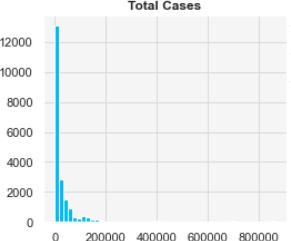
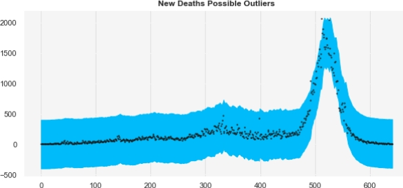
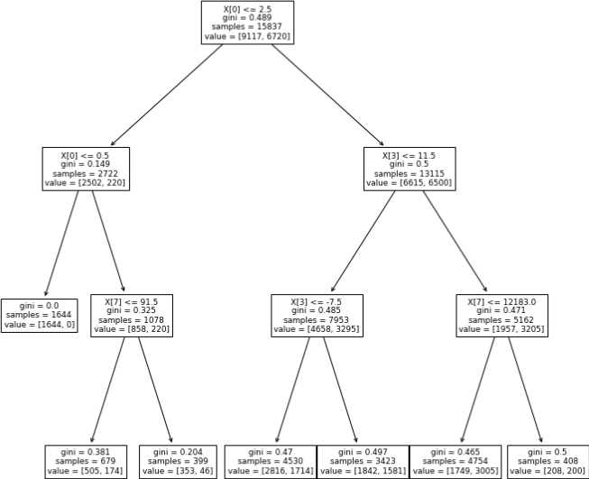

#### COVID-19 Indonesia
# **Summary of Findings**

## **1.0 Table of Contents**

- [**1.0 Table of Contents**](#10-table-of-contents)
- [**2.0 Overview**](#20-overview)
- [**3.0 Research Questions**](#30-research-questions)
- [**4.0 Data Exploration**](#40-data-exploration)
- [**5.0 Data Cleaning**](#50-data-cleaning)
- [**6.0 Analysis Techniques**](#60-analysis-techniques)
- [**7.0 Results Analysis**](#70-results-analysis)
- [**8.0 Question Evaluation**](#80-question-evaluation)
- [**9.0 Threats to Validity**](#90-threats-to-validity)
- [**10.0 References**](#100-references)

---
&emsp;
## **2.0 Overview**

This Indonesian COVID-19 dataset from [Kaggle](https://www.kaggle.com/datasets/hendratno/covid19-indonesia) is a collection of open data sources, providing a time series of COVID-19 pandemic events from both the country level to the province level. It includes pandemic data, demographic data, and derived values.

---
&emsp;
## **3.0 Research Questions**

Due to the highly contagious nature of COVID-19, early interventions involved the promotion of physical distance as a mitigation [1]. As current preventative planning involves the potential for ongoing waves [2], the interaction between distancing and virus spread needs to be identified for distance-based mitigations to be included, if effective. Preparedness for the future can be bolstered by use of large data sets to inform pandemic response [3]. So, while it is logical that maintaining distance is harder in denser urban spaces than spacious rural areas, it is important to investigate whether this is supported by data. Therefore, is there a relationship between population density and COVID cases?

With 628,035,553 worldwide cases reported [4], COVID-19 has placed healthcare infrastructure under sustained pressure. Existing provision was overwhelmed [5], exacerbated by insufficient equipment to treat patients [6]. Such conditions can inadvertently lead to avoidable deaths, as illustrated by 53.2% of patients not receiving needed ventilation due to resource limitations during patient surges [7]. Therefore, if anticipating medical demands could reduce deaths through better healthcare planning, are we able to facilitate this by forecasting regional deaths from reported figures?

Prior to the vaccine development, non-pharmaceutical interventions were generally relied on to suppress COVID [8], such as country wide lockdowns. These efforts were initially broadly supported, with the UK April 2020 lockdown being strongly supported [9]. However, COVID cases are still being monitored, with countries maintaining large scale social restriction policies ready to respond to potential outbreaks [10]. Future compliance is likely to impacted by opposition from the population [9]. Only 43% of British people surveyed now believe COVID-19 has been handled well [11]. These unpopular region wide restrictions could be avoided through early identification of local areas with milder interventions. Can we identify whether COVID is likely to be spreading in an area?

---
&emsp;
## **4.0 Data Exploration**

The dataset contained 38 attributes related to COVID-19 monitoring, with the majority containing numerical values and 15 comprising of derived variables. Despite instances initially appearing as an ordered time series, closer inspection revealed a stacked dataset comprising of regional and national instances. To ensure accuracy, care must be taken to filter the appropriate instances for the question.

Investigation into the distribution of the variables with the highest standard deviation reveals attributes relating to cases, deaths, and recoveries are all significantly right skewed, illustrated below:

  

As some machine learning algorithms assume a Gaussian distribution of data [12], data transformation should be considered to make the data set suitable for data modelling [13]. Similarly, consideration should be given to data normalisation given the comparatively massive standard deviation of columns, as seen above, and allow other attributes to have an appropriate contribution to any model [14].

Filtering for regional data, a scatterplot matrix revealed that new deaths are correlated with several attributes. Perhaps predictably, the new cases attribute has the highest coefficient at 0.661. Interestingly, population has a coefficient of 0.376 compared to population density with 0.132, notably under the suggested threshold of 0.3 for weak correlation [15]. This possibly suggests that Indonesia’s denser areas coped with the pandemic adequately, despite evidence indicating a different expected outcome [16]. Overall, this has provided obvious candidates for feature selection.

Finally, to build a classification model, suitability of the ‘Growth Factor of New Cases’ column for conversion into a categorical value was examined. While the missing values can be easily replaced using available formulas [17] and reverse engineering of existing data, an imbalance of classes would cause issues classifying the less populous ones [15]. If values over 1.0 signify COVID is increasing, the balance between classes showing increases and decreases is an acceptable 12240 to 8877.

---
&emsp;
## **5.0 Data Cleaning**

Missing values were visualised using a heatmap to quickly identify areas for inspection. This resulted in two types of outcomes. Firstly, removal. While columns such as ‘City or Regency’ were completely empty, potential removal of columns with sporadic omissions was less clear. Removing the rows with missing data was an option, however this would have led to the removal of research relevant observations [13]. Ultimately, to ensure an understandable model less affected by inauthentic patterns [15], the context of the research questions and domain knowledge led to the removal of 9 columns with missing values and a further 15 deemed to be redundant.

The second approach to missing values involved creating data. As the values in the ‘Growth Factor of New Cases’ column were derived from a simple calculation [17] involving a single column of raw data, these were easy to calculate and insert. Although new data was being created, it did not impact the results as the insertions were not based on assumptions of the data [13]. Values over 1.0 indicated COVID-19 spreading [17]. To allow this to be used in a classification model, one-hot coding was used to convert it into a categorical variable [18]. National and regional values had previously been identified in the same data set. This required filtering of the data into two new subsets both for accurate identification of outliers and analysis. Experiments on these new subsets with automated outlier detection techniques, such as isolation forest, resulted in consistent identification of valid results, even when consensus was sought. Due to its apparent accuracy, exponential smoothing was used to identify outliers: a moving average with more recent data having a larger influence [19]. This is exemplified below:

  

Remaining outliers were removed manually either through identifying impossible values [13] or inspection of scatter plots.

---
&emsp;
## **6.0 Analysis Techniques**

Investigating the relationship between ‘Population Density’ and ‘Total Cases’ entails the use of two numerical attributes. The regionally filtered dataset will be used to avoid distorting the data. Such inputs are straightforward and suitable for simple linear regression [20]. However, owing to the low number of entries available, cross validation will be employed to maximise the available training data [13]. A k-fold value of 10 was chosen due to its resistance to bias and variance in the test error rates [21].

The second research question involves predicting new deaths using a regionally filtered dataset. Plotting a correlation matrix allowed potential relationships between the target and other available attributes to be visualised and inspected, and while any correlation does not imply causation [13], it was a sensible place to begin for feature selection. This was aided by using 0.3, the suggested threshold for weak correlation [13], as a minimum level for inclusion. As this results in multiple numerical inputs and a numerical output, it was appropriate to employ a regression model [20]. Both linear regression and support vector regression will be used to identify the best approach.

Finally, identifying the status of regional spread of COVID-19 has been reduced to a binary choice at the data cleaning stage. A classification model is suitable to this problem [20], with a decision tree, Naïve Bayes classifier, and support vector machine all being utilised for evaluation. Appropriate features are already present in the dataset through actions taken during data cleaning. Removal of variables unlikely to contribute [13] has resulted in a data set close to a minimal subset sufficient for the concept [22]. Such overly specific attributes would possibly hinder generalisation to real world scenarios. For example, using the time zone attribute is unlikely to result in a useful node in a decision tree.

---
&emsp;
## **7.0 Results Analysis**

A simple linear regression model was produced to determine relationship between total cases and population density. This was attempted with raw data and data that had been both normalised and standardised. While the latter produced a clearer plot, the raw data resulted in a superior R2 value of 0.791. Consequently, data points are closer to the linear line when using raw data and thus a better fit [23].

Two models were created to predict deaths from a range of attributes. While the support vector regression model performed marginally better according to MAE, linear regression was notably better according to RMSE. As the aim of the model is to avoid missing large errors, RMSE was the more suitable metric [24]. Comparing attributes, population was a noted outlier as it had a much lower coefficient than the others. To explore this, a null hypothesis stating variable X has no effect on variable Y can be formed. With a confidence interval of 95%, calculating the p-values [25] means that the hypothesis can only be rejected for the total cases, total recovered, and population variables. Domain knowledge may explain this, as new cases on a day doesn’t cause deaths on the same day, whereas the total values track pandemic dynamics over a period. Of the three classification models created, the decision tree was the most successful in identifying the correct class. This is displayed below, where X[0] is new cases, X[3] new active cases, and X[7] total active cases:

  

65% of the test instances were correctly identified. However, this moderate success is tempered by the kappa statistic, which seeks to correct for chance [20]. For this model, the calculated number is 0.25 which suggests only a fair strength of attribute agreement [26]. McHugh proposes that only 4-15% of this data is reliable [27].

---
&emsp;
## **8.0 Question Evaluation**

Some debate remains regarding population density and COVID spread. Researchers in India suggest there is a link, opposed by researchers in the USA [16]. The model built here would indicate there is evidence of higher total case numbers in denser population areas. However, the presence of Jakarta acting as an outlier has already been recognised [28] due to its unique size and status in the region [29]. How data from such a disproportionally different city should be handled should be discussed. For now, this model provides suitable evidence that social distancing should remain part of future mitigations in Indonesia.

Secondly, the linear regression model built to predict new COVID deaths shows promise. It was able to identify the general trend of deaths, struggling mainly with predicting the size of spikes. Evaluating the model has indicated that removing 4 of the 7 input attributes according to p-values could improve accuracy [25], and this is intriguing, with the limitations of the dataset it is unlikely that anything could be substituted in. Following this reworking, this model may be useful to some communities to prepare for a general increase in deaths and where forecasts are not the only indicator relied upon.

The initial response to the decision tree was positive. It was able to correctly classify almost two thirds of test instances, suggesting that it may have been of limited use alongside other resources. However, deeper analysis revealed a weak kappa statistic and a subsequent suggestion that only 4-15% of the data was reliable [27]. Simply, this means it should not be used to inform major decisions. A more accurate model might be possible if a wider range of information was available. Similar datasets contain information on hospital admissions and numbers of people isolating [30], and this could be a good place to begin.

---
&emsp;
## **9.0 Threats to Validity**

The ‘New Case’ attribute remains an internal threat to the validity of the analysis. Currently, it is a contributing factor to all three models created and is central to the understanding of COVID in general. As even experienced nurses needed additional training to correctly administer tests [31], a typical individual is likely to produce inconsistent results without similar intervention. This is further compounded by the global demand for testing equipment [32], as procurement from different manufacturers impacts standardisation, with research indicating cost as the differentiating factor [33]. The cumulative result is individuals inconsistently testing using inconsistent equipment at an unknown scale.

Secondly, Indonesia has several traits likely to cause an external threat to validity. Jakarta dominates over both Indonesian and South Asian cities with its 20 million residents living in the overburdened city [29]. Consequently, the few raw values present in the dataset are not truly representative of the full Indonesian demographic. Normalising the data through the reintroduction of the ‘per Million’ columns removed during the data cleaning would be sensible. Additionally, the behavioural changes caused by living across over 16,000 islands [34] with 80% of the population in the western half [35] mean that generalising the results of the models would likely be inconsistent outside of large urban areas.

Finally, research into population density is likely threatened by statistical validity. Use of the ‘Total Cases’ attribute limited the model to the most recent value, resulting in one entry for each of the 34 areas recorded. Poor sample size can contribute to inaccurate conclusions [36], although each one did represent an aggregation of thousands of individuals. Furthermore, population values for the 35 regional areas are static throughout the dataset and don’t change in over a year. There would be more confidence in the results with more values and precise figures.

---
&emsp;
## **10.0 References**

[1] UK Cabinet Office, “Review of two metre social distancing guidance,” 26 June 2020. [Online]. Available: https://www.gov.uk/government/publications/review-of-two-metre-social-distancing-guidance/review-of-two-metre-social-distancing-guidance. [Accessed 05
November 2022].

[2] T. Constantino and U. Tirnakli, “Predicting COVID-19 peaks around the world,” Frontiers in Physics, vol. 8, p. 217, 2020.

[3] F. Ntoumi and A. Zumla, “Advancing accurate metrics for future pandemic preparedness,” Lancet, vol. 16, no. 399, pp. 1443-1445, 16 April 2022.

[4] World Health Organisation, “WHO Coronavirus (COVID-19) Dashboard,” 2 November 2022. [Online]. Available: https://covid19.who.int/. [Accessed 2 November 2022].

[5] I. Giannopoulou and G. O. Tsobanoglou, “COVID-19 pandemic: challenges and opportunities for the Greek health care system,” Irish Journal of Psychological Medicine, vol. 37, no. 3, p. 226–230, 2020.

[6] H. Hill and C. Roadevin, “How can we decide a fair allocation of healthcare resources during a pandemic?,” Journal of Medical Ethics, vol. 47, no. 84, 2021.

[7] P. Quah, A. Li and J. Phua, “Mortality rates of patients with COVID-19 in the intensive care unit: a systematic review of the emerging literature,” Crit Care, vol. 24, no. 285, 12 May 2020.

[8] A. Agosto, A. Campas and A. Renda, “Monitoring COVID-19 contagion growth,” Statistics in Medicine, vol. 40, no. 18, pp. 4150-4160, 15 August 2021.

[9] S. Collignon, I. Makropoulos and R. Wolfgang, “Consensus secured? Elite and public attitudes to “lockdown” measures to combat Covid-19 in England,” Journal of Elections, Public Opinion and Parties, vol. 31, no. 1, pp. 109-121, 15 June 2021.

[10] Laman Resmi Republik Indonesia, “Acceleration of COVID-19 Handling in Indonesia,” 03 November 2022. [Online]. Available:
https://covid19.go.id/storage/app/media/Penanganan%20COVID-19/2022/November/20221104-eng-ver-update-percepatan-penanganan-covid-19-di-indonesia.pdf. [Accessed 2022 November 04].

[11] YouGov, “COVID-19 Tracker: Government Handling,” 30 July 2022. [Online]. Available: https://yougov.co.uk/topics/international/articles-reports/2020/03/17/perception-government-handling-covid-19. [Accessed 1 November 2022].

[12] R. A. Peterson and J. E. Cavanaugh, “Ordered quantile normalization: a semiparametric transformation built for the cross-validation era,” Journal of Applied Statistics, vol. 47, no. 13-15, pp. 2312-2327, 2019.

[13] D. Cielen, A. Meysman and Ali. M, Introducing data science, Shelter Island, NY: Manning, 2016.

[14] B. Singh and D. Singh, “Investigating the impact of data normalization on classification performance,” Applied Soft Computing, vol. 97, 2020.

[15] J. D. Kelleher and B. Tierney, Data Science, Cambridge, MA: MIT Press, 2018.

[16] A. Bhadra, A. Mukherjee and K. Sark, “Impact of population density on Covid-19 infected and mortality rate in India,” Model Earth Syst Environment, vol. 7, no. 1, pp. 623-629, 2021.

[17] UK Health Security Agency, “The R value and growth rate,” 28 October 2022. [Online]. Available: https://www.gov.uk/guidance/the-r-value-and-growth-rate. [Accessed 1 November 2022].

[18] W. McKinney, Python for Data Analysis, Sebastopol, CA: O'Reilly, 2018.

[19] National Institute of Standards and Technology, “Introduction to Time Series Analysis,” October 2022. [Online]. Available: https://www.itl.nist.gov/div898/handbook/pmc/section4/pmc4.htm. [Accessed 03 November 2022].

[20] I. H. Witten, E. Frank , M. A. Hall and C. J. Pal, Data mining: practical machine learning tools and technique, Cambridge, MA: Elsevier, 2017.

[21] G. James, D. Witten, T. Hastie and R. Tibshirani, An Introduction to Statistical Learning, New York, NY: Springer, 2013.

[22] M. Dash and H. Liu, “Feature Selection for Classification,” Intelligent data analysis, vol. 1, no. 1-4, pp. 131-156, 1997.

[23] D. M. Diez, C. D. Barr and M. Cetinkaya-Rundel,, OpenIntro statistics, openintro.org/os, 2019.

[24] B. Zheng, P. He, L. Zhao and L. Hongwei, “A hybrid machine learning model for range estimation of electric vehicles,” in 2016 IEEE Global Communications Conference, Washington, DC, 2016.

[25] J. C. Travers, B. G. Cook and L. Coo, “Null hypothesis significance testing and p values,” Learning Disabilities Research and Practice, vol. 32, no. 4, pp. 208-215, 2017.

[26] D. G. Altman, Practical statistics for medical research, London: Chapman & Hall, 1999.

[27] M. McHugh, “Interrater reliability: the kappa statistic,” Biochemia medica, vol. 22, no. 3, p. 276–282., 2012.

[28] S. Wheatley and D. Sornette, “Multiple Outlier Detection in Samples with Exponential & Pareto Tails: Redeeming the Inward Approach & Detecting Dragon Kings,” SSRN Electronic Journal, 2015.

[29] R. Cybriwskya and L. R. Ford, “City profile: Jakarta,” Cities, vol. 18, no. 3, pp. 199-210, 2001.

[30] E. e. a. Dong, “The Johns Hopkins University Center for Systems Science and Engineering COVID-19 Dashboard: data collection process, challenges faced, and lessons learned,” The Lancet Infectious Diseases, 2022.

[31] M. Gaffuri , P. Capaccio, S. Torretta, M. Daga, G. V. Zuccotti and L. Pignataro, “An Unusual Retained Choanal Foreign Body: A Possible Complication of COVID-19 Testing With Nasopharyngeal Swab,” Environment and Urbanization, pp. 10-31, 2021.

[32] M. J. Binnicker, “Challenges and Controversies to Testing for COVID-19,” Journal of Clinical Microbiology, vol. 58, no. 11, 2020.

[33] K. Ramdas, A. Darzi and S. Jain , “‘Test, re-test, re-test’: using inaccurate tests to greatly increase the accuracy of COVID-19 testing,” Nature Medicine, vol.26, pp. 810-811, 2020.

[34] The Jakarta Post, “16,000 Indonesian islands registered at UN,” August 21, 2017, 21 August 2017. [Online]. Available: https://www.thejakartapost.com/news/2017/08/21/16000-indonesian-islands-registered-at-un.html. [Accessed 11 November 2022].

[35] M. Z. Tadjoeddin, A. Chowdury and S. Mansoob, “Routine Violence in Java, Indonesia: Neo-Malthusian and Social Justice Perspectives,” in Climate Change, Human Security and Violent Conflict, Berlin, Heidelberg, Springer, 2012, p. 633–650. 14

[36] M. A. García-Pérez, “Statistical conclusion validity: some common threats and simple remedies,” Frontiers in psychology, vol. 3, p. 325, 2012.